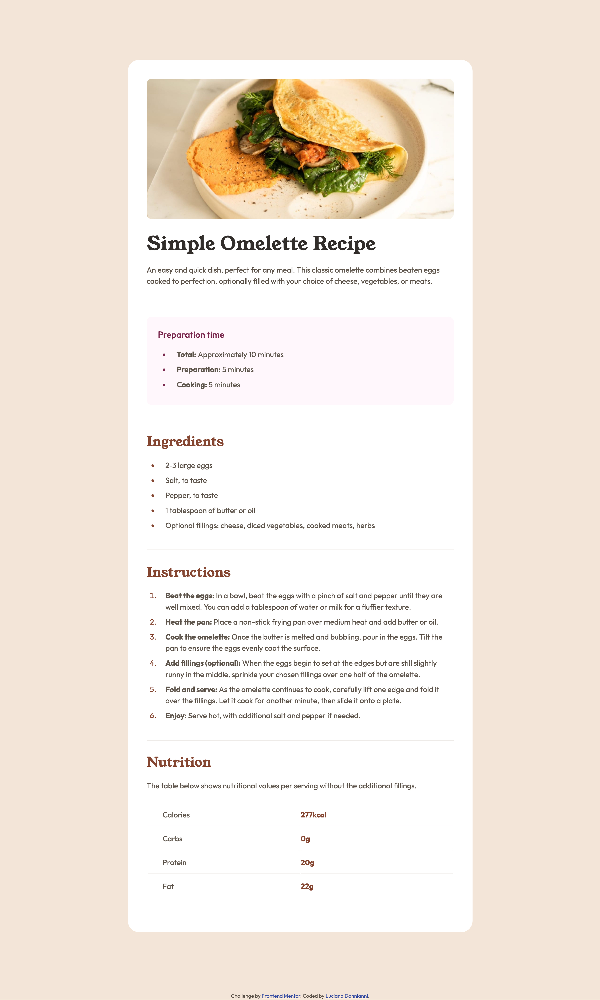

# Frontend Mentor - Recipe page solution

This is a solution to the [Recipe page challenge on Frontend Mentor](https://www.frontendmentor.io/challenges/recipe-page-KiTsR8QQKm). Frontend Mentor challenges help you improve your coding skills by building realistic projects. 

## Table of contents

- [Overview](#overview)
  - [The challenge](#the-challenge)
  - [Screenshot](#screenshot)
  - [Links](#links)
- [My process](#my-process)
  - [Built with](#built-with)
  - [What I learned](#what-i-learned)
  - [Continued development](#continued-development)
- [Author](#author)
- [Acknowledgments](#acknowledgments)

## Overview

### Screenshot

### Links

- Solution URL: [Add solution URL here](https://your-solution-url.com)
- Live Site URL: [Add live site URL here](https://your-live-site-url.com)

## My process

### Built with

- Semantic HTML5 markup
- CSS custom properties
- Flexbox
- Mobile-first workflow

### What I learned

I learned how to work with a little more content, up until now there were simple card. I practice and improve the mobile, tablet and desktop design. I used the table element for the last section (I don't know if it is the better option but it worked for me). Copy the design was a challenge, it has dif padding and margins, etc.

### Continued development

I'd like to focus in responsive designs, increasingly upping the difficulty of the challenges. 

## Author

- Frontend Mentor - [@ldonnianni](https://www.frontendmentor.io/profile/ldonnianni)

## Acknowledgments

I'd like to thank Steven Stround, @stroudy, he've been giving me feedback on past projects and all of his tips where great, and helped me improve.

